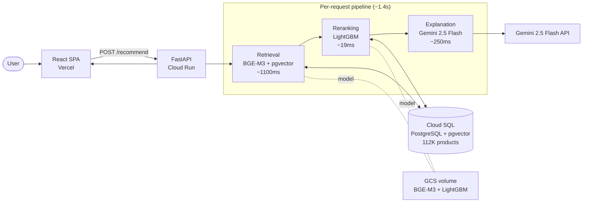
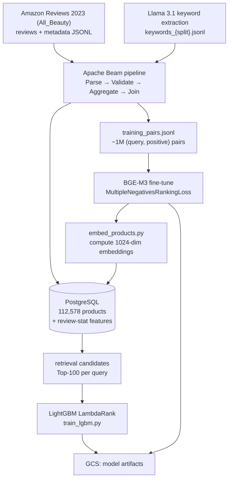

# Architecture

System architecture for ChatBeauty — an LLM & RAG based Amazon beauty-product
recommender. A user describes their situation in natural language; the system returns
Top-5 products with a data-grounded explanation for each.

For per-layer detail see [backend-architecture.md](backend-architecture.md),
[frontend-architecture.md](frontend-architecture.md), [ml-pipeline.md](ml-pipeline.md),
[db-schema.md](db-schema.md), and [deployment.md](deployment.md).

## High-level

The runtime path is a two-stage retrieve-then-rerank recommender followed by an LLM
explanation step:

1. **Retrieval** — encode the user scenario with the fine-tuned BGE-M3 (1024-dim) and run
   a pgvector cosine-similarity search to get the Top-100 candidate products.
2. **Reranking** — score the 100 candidates with a LightGBM LambdaRank model over 10
   metadata features and keep the Top-5.
3. **Explanation** — Gemini 2.5 Flash writes a short, review-grounded reason for all 5
   products in a **single** API call.

There is **no authentication**: `/recommend` is a single public endpoint (see
[Known limitations](#known-limitations--future-work)).

## Offline data & ML pipeline

The pipeline is offline (Apache Beam DirectRunner) and produces two things: the populated
`products` table and the BGE-M3 fine-tuning pairs. Embeddings are computed separately by
`ml/scripts/embed_products.py` and written back to the same table. The HNSW vector
index is built **after** embeddings are loaded. Details: [ml-pipeline.md](ml-pipeline.md).

## Components

| Layer | Tech | Where | Doc |
|---|---|---|---|
| Frontend | React 19 + TypeScript + Vite (SPA) | `frontend/` | [frontend-architecture.md](frontend-architecture.md) |
| Backend API | FastAPI + Uvicorn | `backend/app/` | [backend-architecture.md](backend-architecture.md) |
| Database | PostgreSQL 16 + pgvector (`halfvec` + HNSW) | `backend/sql/` | [db-schema.md](db-schema.md) |
| ML | BGE-M3 (fine-tuned), LightGBM, Apache Beam | `ml/` | [ml-pipeline.md](ml-pipeline.md) |
| Deploy | Cloud Run, Cloud SQL, GCS, Vercel | `deploy/`, `backend/Dockerfile` | [deployment.md](deployment.md) |

## Latency budget

| Stage | Typical | Notes |
|---|---|---|
| Retrieval (pgvector HNSW) | ~1,100ms | dominated by query encoding + ANN search |
| Reranking (LightGBM) | ~19ms | one batched DB feature lookup + predict |
| Explanation (Gemini 2.5 Flash) | ~250ms | all 5 explanations in one call |
| **Total** | **~1,400ms** | logged per request via `LatencyMiddleware` |

## Known limitations & future work

These are the current, deliberate constraints of the system. Detailed docs link here
rather than restating them.

- **No authentication / rate limiting.** `/recommend` is public and unauthenticated
  (`--allow-unauthenticated` on Cloud Run). A public, unauthenticated endpoint is exposed
  to abuse; API rate limiting is future work.
- **No automated tests.** There is no pytest/vitest suite today; changes are verified by
  running the stack and exercising `/health` + a sample `/recommend` (see
  [development.md](development.md)). *Planned:* an integration test for `POST /recommend`.
- **No DB migration tool.** Schema is applied by running `backend/sql/init.sql` directly;
  there is no Alembic/migration history. Adopting a migration tool is a future option
  (see [db-schema.md](db-schema.md)).
- **MLOps maturity.** Model versioning is by GCS path convention (e.g. the timestamped
  `bge-m3-finetuned-20260202-120852/` directory); there is no experiment tracking
  (MLflow/W&B) or production model/data-drift monitoring yet — both are future work.
- **`top_k` is fixed at 5.** The API request has no `top_k` field and the route hardcodes
  Top-5; clients that send `top_k` are ignored (see [api-spec.md](api-spec.md)).
- **Retrieval latency dominates** (~1.1s of ~1.4s), most of it query encoding. The vector
  index is HNSW over a `halfvec(1024)` column; further `ef_search` / quantization tuning is
  possible future work.
