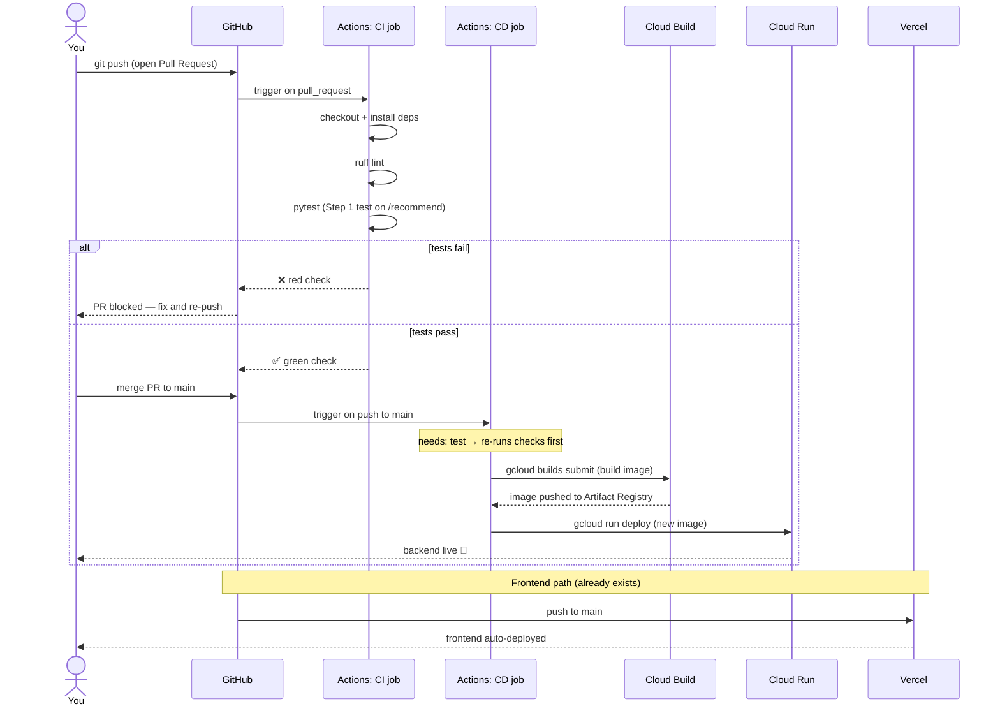

# Testing & CI/CD Primer (for TODO Steps 1 & 2)

> Personal learning notes — plain-language explanation of the testing + GitHub Actions CI/CD
> work in [`TODO.md`](../TODO.md) (Current focus **Step 1** and **Step 2**). Written for someone
> new to testing and CI/CD. Search this when confused about *why* those steps exist or *what*
> they change.
>
> **Note (2026-06-02):** the paid GCP infra was retired to avoid cost, so the **CD half** below
> (the `gcloud run deploy` examples and the Cloud Run boxes in the diagram) is now *historical* —
> a teaching example of how CD works, not the current target. **CI is still the live plan** (lint
> + pytest on PRs); CD is deferred until the backend is re-platformed on a free host. The
> *concepts* (CI gate, build → deploy, secrets, runners) carry over unchanged to any host. See
> [deployment.md](deployment.md) for the free-tier direction.

---

## Part 1 — The pytest test (Step 1)

### What a test actually is here

A test is just code that runs your *other* code and checks the answer is what you expect. For
ChatBeauty, the key endpoint is `POST /recommend`. An **integration test** calls that endpoint
exactly like a real user would and asserts the response looks right — it exercises the whole
retrieve → rerank → explain pipeline together (as opposed to a *unit test*, which would check one
tiny function in isolation).

Concretely, you'd add a new file like `backend/tests/test_recommend.py`:

```python
from fastapi.testclient import TestClient
from app.main import app

client = TestClient(app)   # an in-memory fake HTTP client — no real server needed

def test_recommend_returns_five_products():
    resp = client.post("/recommend", json={"user_input": "gentle cleanser for dry skin"})

    assert resp.status_code == 200             # the request succeeded
    body = resp.json()
    assert len(body["recommendations"]) == 5   # pipeline returns Top-5
    assert body["recommendations"][0]["title"] # each item has a title
```

You run it with one command: `pytest`. Green = the contract holds. Red = something broke, and it
tells you exactly which assertion failed.

### Why we're doing this

Right now, the only way to know `/recommend` still works after a change is to **manually** spin up
the server, type a query, and eyeball the output. That's slow and easy to skip. A test:

1. **Catches regressions** — if someone edits `reranking.py` and accidentally returns 4 items
   instead of 5, the test fails *immediately* instead of a user noticing in production.
2. **Documents the contract** — the test literally spells out "this endpoint takes `user_input`
   and returns 5 recommendations."
3. **Is the gate for CI** (Step 2) — automation can run `pytest` but can't "eyeball" output. The
   test is what makes automated checking possible.

There's a real wrinkle for *this* app worth flagging: the pipeline depends on the BGE-M3 model, a
Postgres DB with 112k embeddings, and the Gemini API. A test shouldn't need all that. So part of
Step 1's work is deciding **how much to mock** (replace with fakes):

| Approach | What's real | Trade-off |
|---|---|---|
| **Fully mocked** (recommended start) | Nothing external; fake the retrieval + Gemini calls | Fast, runs anywhere, but only tests *wiring/shape*, not real quality |
| **DB-backed** | Real Postgres (small seed), mock Gemini | Tests real SQL/pgvector, slower, needs a test DB |
| **Full e2e** | Everything real | Highest confidence, slow, costs Gemini calls, flaky |

For a CI gate you usually start fully-mocked (proves nothing crashed) and add a deeper test later.

---

## Part 2 — CI/CD and GitHub Actions (Step 2)

### The vocabulary

- **CI = Continuous Integration**: every time you push code, automatically run checks (lint +
  tests) so broken code is caught *before* it merges.
- **CD = Continuous Deployment/Delivery**: once checks pass, automatically ship the code to the
  server (Cloud Run) — no manual `gcloud deploy` from your laptop.
- **GitHub Actions**: GitHub's built-in automation. You describe the steps in a YAML file under
  `.github/workflows/`, and GitHub runs them on a fresh cloud machine whenever a trigger fires
  (e.g. "on every push").

### The concrete change

A new file, e.g. `.github/workflows/ci.yml`:

```yaml
name: CI/CD
on:
  push:
    branches: [main]        # CD: deploy when main changes
  pull_request:             # CI: just check, on every PR

jobs:
  test:                     # ---- CI ----
    runs-on: ubuntu-latest
    steps:
      - uses: actions/checkout@v4          # grab the code
      - uses: actions/setup-python@v5
        with: { python-version: "3.12" }
      - run: pip install poetry && poetry install
      - run: poetry run ruff check .       # lint
      - run: poetry run pytest             # <-- Step 1's test runs here

  deploy:                   # ---- CD ----
    needs: test             # only runs if `test` passed
    if: github.ref == 'refs/heads/main'
    runs-on: ubuntu-latest
    steps:
      - uses: actions/checkout@v4
      - run: gcloud builds submit --tag ...   # build image (from deploy/setup-gcp.sh)
      - run: gcloud run deploy chatbeauty-backend --image ...
```

The deploy steps aren't invented — they're the same `gcloud builds submit` / `gcloud run deploy`
commands already documented in `deploy/setup-gcp.sh`. CI/CD just *automates running them* and gates
them behind passing tests.

### Why we're doing this

- Today, deploying means remembering to run the right `gcloud` commands by hand — error-prone, and
  nothing stops you from deploying code that fails tests.
- With this: push to `main` → tests run → **only if green** does it deploy. A teammate's broken PR
  can't reach production.
- The frontend already does this (Vercel auto-deploys on push) — this brings the backend to parity.

One setup cost to know about: CD needs GitHub to authenticate to Google Cloud. That means storing a
GCP credential as a **GitHub Secret** (or, better, Workload Identity Federation — keyless auth).
That's the fiddliest part of Step 2.

---

## The workflow, as a sequence diagram



---

## Alternatives (the menu)

**For testing (Step 1):**
- **Real test DB in a container** (`testcontainers` / docker-compose) — higher fidelity, more
  setup. Reasonable later.
- **Schemathesis** — auto-generates tests from your API schema. Good for edge cases, weaker on
  business logic ("is it really 5 items?").
- **Just a smoke test** — a `/health` check only. Lowest value; doesn't protect the actual
  recommendation logic. Avoid this as the *only* test.

**For CI/CD (Step 2):**
- **Google Cloud Build triggers** instead of GitHub Actions — since you're already on GCP, Cloud
  Build can watch the repo and build/deploy natively. Fewer auth headaches (no cross-cloud secret),
  but CI and CD both live in GCP instead of next to your code on GitHub. Strong all-GCP alternative.
- **GitLab CI / CircleCI / Jenkins** — same concepts, different host. No reason to add one when your
  code is on GitHub.
- **CI-only, manual deploy** — run tests automatically but keep deploying by hand. A valid *first
  milestone*: do the CI half now, add CD later once you trust it. Lower risk while learning.
- **Cloud Run "deploy from source"** (`gcloud run deploy --source .`) — skips the explicit build
  step; Cloud Run builds for you. Simpler YAML, less control over the image.

### Recommended path for someone new

**Step 1 fully-mocked test → Step 2 as CI-only first (lint + pytest on PRs), then add the
CD/deploy job** once the CI half is green and trusted. You get the safety net immediately and tackle
the trickier GCP-auth piece as a separate, smaller step.

---

## Glossary (quick reference)

| Term | Meaning |
|---|---|
| **Unit test** | Checks one small function in isolation |
| **Integration test** | Checks several pieces working together (e.g. the whole `/recommend` path) |
| **Mock** | A fake stand-in for a real dependency (DB, model, API) so tests run fast and offline |
| **Smoke test** | A minimal "does it even start / is it alive" check |
| **Lint** | Automated style/error check on code (here: `ruff`) without running it |
| **pytest** | The Python test runner; finds `test_*.py` files and runs `test_*` functions |
| **CI** | Continuous Integration — auto-run checks on every push/PR |
| **CD** | Continuous Deployment — auto-ship to the server once checks pass |
| **GitHub Actions** | GitHub's automation engine; config lives in `.github/workflows/*.yml` |
| **Workflow / job / step** | A workflow is one YAML file; it has jobs; each job has ordered steps |
| **Runner** | The fresh cloud machine GitHub spins up to run a job |
| **GitHub Secret** | Encrypted credential (e.g. GCP key) the workflow can use without exposing it |
| **Cloud Build** | GCP's image-build service (`gcloud builds submit`) |
| **Cloud Run** | GCP's container host where the backend runs (`gcloud run deploy`) |
| **Artifact Registry** | Where built container images are stored before Cloud Run pulls them |
